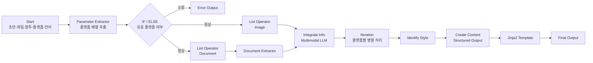

# Dify로 다중 플랫폼 콘텐츠 생성 Workflow 구현하기

하나의 초안을 Twitter와 LinkedIn에 그대로 복사해 게시하면 플랫폼별 문체와 정보 밀도가 맞지 않는다. 그렇다고 매번 플랫폼 특성을 다시 확인하고, 같은 참고 자료를 읽은 뒤 글을 각각 작성하는 것도 반복 작업이 된다.

이번 실습에서는 사용자가 초안, 참고 파일, 원하는 말투, 대상 플랫폼과 언어를 입력하면 이를 분석해 **플랫폼별 게시용 콘텐츠를 생성하는 Dify Workflow**를 구성했다. 자연어 입력을 구조화하고, 이미지와 문서를 서로 다른 방식으로 처리하며, 여러 플랫폼을 병렬로 순회한 뒤 결과를 일정한 Markdown 형식으로 반환하는 것이 핵심이었다.

먼저 범위를 정확히 정리할 필요가 있다. 교안의 명칭은 ‘블로그 글 게시 워크플로우’이지만, 현재 구현에는 Twitter나 LinkedIn API를 호출하는 Node가 없다. 따라서 이 Workflow가 수행하는 일은 **자동 게시가 아니라 게시 직전 콘텐츠 생성과 정리**까지다.

## 1. 구현 목표

입력값은 다음 다섯 가지로 정의했다.

- `draft`: 콘텐츠의 출발점이 되는 초안
- `user_file`: 참고할 문서 또는 이미지 목록
- `voice_and_tone`: 원하는 목소리와 어조
- `platform`: 하나 이상의 대상 플랫폼을 입력하는 자유 텍스트
- `language`: 한국어, English, 日本語 중 하나

사용자는 `Twitter and LinkedIn`, `x, linkedin`, `twitter & insta`처럼 플랫폼을 여러 방식으로 입력할 수 있다. Workflow는 이 값을 표준화된 배열로 변환하고, 업로드 파일을 이미지와 문서로 분리한 뒤, 각 플랫폼에 맞는 결과를 생성해야 했다.

전체 흐름은 다음과 같다.



## 2. 자연어 플랫폼 입력을 배열로 변환하기

첫 번째 핵심은 `platform` 입력을 바로 반복 처리에 사용하지 않은 것이다. 사용자는 구분자와 표기법을 일관되게 입력하지 않는다. `X`, `Twitter`, `twitter`, `Twitter and LinkedIn`은 의미상 같은 플랫폼을 포함하지만 문자열 자체는 다르다.

이를 처리하기 위해 **Parameter Extractor**를 사용했다. 추출 결과는 `Array[String]` 형식의 `platform` 변수로 정의했다. LLM에는 다음 작업을 지시했다.

- 쉼표, 세미콜론, 공백, 줄바꿈, `and`, `&`, `|` 등 다양한 구분자 처리
- `X → Twitter`, `insta → Instagram`과 같은 이름 표준화
- 중복 제거
- 유효한 플랫폼을 배열로 반환

예를 들어 다음 입력은

```text
x and linkedin
```

아래와 같은 배열로 변환된다.

```json
["Twitter", "LinkedIn"]
```

이 단계의 의미는 단순히 문자열을 정리하는 데 있지 않다. 뒤의 **Iteration Node가 순회할 수 있는 자료구조를 만드는 전처리 단계**라는 점이 중요했다. Workflow에서는 LLM의 자연어 출력보다 다음 Node가 안정적으로 소비할 수 있는 데이터 형식이 더 중요하다.

## 3. 잘못된 입력은 생성 전에 종료하기

Parameter Extractor가 플랫폼을 찾지 못하면 지정된 오류 문구를 배열에 반환하도록 설정했고, 다음 **IF/ELSE Node**에서 해당 문구의 포함 여부를 검사했다.

오류가 확인되면 콘텐츠 생성 Node로 진행하지 않고 즉시 Output으로 분기했다. 잘못된 입력을 뒤늦게 발견하면 Integrate Info, 플랫폼 분석, 콘텐츠 생성에 모델 호출이 이미 발생한다. 따라서 검증을 앞단에 배치한 것은 실행 시간과 Token 사용을 줄이기 위한 설계였다.

다만 이 방식에는 약점이 있다. 조건식이 특정 오류 문자열에 의존하므로, LLM이 문구를 조금만 다르게 생성해도 분기가 실패할 수 있다. 또한 프롬프트의 “알 수 있지만 합리적인 플랫폼 이름은 유지한다”는 규칙과 “유효하지 않은 플랫폼은 중단한다”는 요구가 충돌할 수 있다.

운영 환경이라면 LLM이 오류 문장을 생성하게 하기보다 다음과 같이 명시적인 상태값을 반환하도록 바꾸는 편이 낫다.

```json
{
  "is_valid": true,
  "platforms": ["Twitter", "LinkedIn"],
  "invalid_inputs": []
}
```

이렇게 하면 IF/ELSE는 자연어 문장이 아니라 Boolean 값을 기준으로 분기할 수 있다.

## 4. 이미지와 문서를 같은 방식으로 처리하지 않기

업로드된 `user_file`에는 이미지와 문서가 함께 들어올 수 있다. 그러나 두 파일 유형은 처리 경로가 다르다.

- 이미지는 Vision을 지원하는 LLM에 직접 전달할 수 있다.
- PDF나 DOCX 같은 문서는 먼저 텍스트로 변환해야 한다.

따라서 두 개의 **List Operator**를 병렬로 배치했다. 하나는 `type in image`, 다른 하나는 `type in document` 조건으로 파일을 분리했다. 문서 목록은 **Document Extractor**로 보내 텍스트를 추출했고, 이미지 목록은 이후 Multimodal LLM의 Vision 입력으로 연결했다.

이 설계를 통해 파일 목록 전체를 하나의 Node에 억지로 전달하지 않고, 데이터 유형별 전처리를 분리할 수 있었다. 실제 운영 Workflow에서도 “입력은 하나지만 처리 방식은 다르다”면 초기에 타입을 분기하는 편이 디버깅과 확장에 유리하다.

## 5. 생성 전에 정보를 한 번 통합하기

분리된 참고 자료는 **Integrate Info LLM Node**에서 다시 결합했다. 이 Node는 초안, 문서 추출 결과, 이미지를 분석해 다음과 같은 콘텐츠 기반을 정리한다.

- 핵심 메시지와 목적
- 주요 사실, 수치, 인용문
- 차별점과 설득 근거
- 참여를 유도할 수 있는 질문과 Call-to-Action
- 플랫폼별로 변환할 수 있는 소재

여기서 바로 플랫폼별 글을 만들지 않고, 먼저 공통 정보를 통합한 이유는 중복 분석을 줄이기 위해서다. 플랫폼이 세 개라면 각 플랫폼 생성 Node가 원본 파일을 세 번 다시 분석하는 것보다, 공통 기반을 한 번 만든 뒤 플랫폼별 형식만 달리 적용하는 구조가 더 효율적이다.

Workflow YML에서는 이 단계와 최종 콘텐츠 생성 단계에 Gemini 계열 Multimodal Model을 연결하고, 플랫폼 추출과 스타일 분석에는 EXAONE 기반 OpenAI-compatible Model을 사용했다. 모든 작업에 동일한 모델을 사용하지 않고 역할에 따라 모델을 분리했다는 점도 확인할 수 있었다.

## 6. Iteration으로 플랫폼별 생성 작업 분리하기

정규화된 플랫폼 배열은 **Iteration Node**의 입력이 된다. 반복 내부는 두 단계로 구성했다.

### Identify Style

현재 반복 항목인 플랫폼 이름을 받아 다음 정보를 분석한다.

- 플랫폼의 사용자와 콘텐츠 성격
- 적정 길이와 문체
- 줄바꿈, Emoji, Hashtag 사용 방식
- Call-to-Action 방식
- 플랫폼별 기술적 제약

### Create Content

Identify Style의 결과와 Integrate Info의 통합 정보, 사용자가 지정한 언어와 말투를 함께 받아 최종 게시물을 생성한다.

즉, 콘텐츠 생성 역할을 다음과 같이 분리했다.

```text
플랫폼 규칙 분석 → 실제 게시물 생성
```

하나의 Prompt에 모든 요구를 넣는 것보다 중간 판단을 분리하면 어느 단계에서 결과가 어긋났는지 확인하기 쉽다. 플랫폼 형식이 틀렸다면 Identify Style을, 원본 내용이 누락됐다면 Integrate Info를, 문체가 어색하다면 Create Content를 우선 점검할 수 있다.

Iteration은 병렬 모드를 활성화하고 최대 병렬 처리 수를 10으로 설정했다. 플랫폼이 여러 개일 때 순차 실행보다 전체 대기 시간을 줄일 수 있지만, 운영 시에는 Provider의 Rate Limit과 동시 호출 비용을 함께 확인해야 한다. 최대 병렬 수를 크게 설정하는 것이 항상 더 빠르다는 보장은 없다.

## 7. Structured Output으로 후속 Node의 입력 보장하기

Create Content의 결과는 다음 JSON Schema를 따르도록 설정했다.

```json
{
  "type": "object",
  "properties": {
    "platform_name": {
      "type": "string"
    },
    "post_content": {
      "type": "string"
    }
  },
  "required": ["platform_name", "post_content"],
  "additionalProperties": false
}
```

이를 통해 Iteration 결과는 플랫폼 이름과 게시물 본문을 가진 객체 배열로 반환된다. 자유 형식의 텍스트를 다음 Node에서 다시 해석하지 않아도 되므로 변수 참조가 명확해졌다.

Structured Output은 출력 구조를 안정화하지만, 내용의 정확성까지 보장하지는 않는다. `platform_name`과 `post_content` 필드가 존재해도 플랫폼 규칙을 잘못 적용하거나 원본에 없는 내용을 생성할 가능성은 남는다. 구조 검증과 내용 검증은 별개의 문제다.

## 8. 최종 형식은 LLM이 아닌 Jinja2로 처리하기

Iteration의 원시 출력은 객체 배열이므로 사람이 바로 읽기 어렵다. 마지막 단계에서는 **Template Node**에 다음 Jinja2 Template을 적용했다.

```jinja2

# {{ item.platform_name }}
{{ item.post_content }}


```

결과는 플랫폼 이름을 Heading으로 표시하고, 그 아래에 게시물 본문을 배치한 Markdown으로 변환된다.

이 단계에서 LLM을 추가로 호출하지 않은 점이 중요하다. 배열을 반복하고 문자열을 배치하는 작업에는 추론이 필요하지 않다. Template Node를 사용하면 같은 입력에 같은 형식이 적용되고, Token 비용도 발생하지 않는다.

이번 Workflow를 통해 가장 명확하게 확인한 원칙은 다음이었다.

> 판단과 생성에는 LLM을 사용하고, 검증·반복·형식화처럼 규칙이 명확한 작업에는 전용 Node를 사용해야 한다.

## 9. 테스트 결과

테스트 입력은 교안의 예시를 기준으로 구성했다.

```text
초안: 신입 채용 시장
목소리와 어조: 전문적이고 친절하게
대상 플랫폼: Twitter and LinkedIn
언어: 한국어
```

실행 결과, `Twitter`와 `LinkedIn`이 별도의 반복 항목으로 처리되었고, 최종 Output에서는 플랫폼별 게시물이 구분된 Markdown 형식으로 반환되는 것을 확인했다.

특히 전체 Workflow를 다시 실행하지 않고 **Cached Variables**에서 중간 값을 변경해 개별 Node를 재검증할 수 있었다. 오류가 발생했을 때는 해당 Node의 Last Run Log를 기준으로 입력 변수와 출력 형식을 확인하는 방식이 효과적이었다.

다만 결과가 정상적으로 반환됐다는 사실만으로 Workflow의 품질이 검증된 것은 아니다. 다음 항목은 별도의 평가 기준이 필요하다.

- 원본 초안과 참고 자료의 사실이 누락되거나 왜곡되지 않았는가
- 플랫폼별 길이와 형식 요구를 실제로 충족했는가
- 같은 입력에서 결과 품질의 편차가 어느 정도인가
- 여러 플랫폼을 병렬 처리할 때 지연과 실패율이 어떻게 변하는가
- 생성된 Hashtag와 Call-to-Action이 실제 목적에 적합한가

## 10. 구현하면서 확인한 한계

### 10.1 실제 게시 자동화는 포함되지 않았다

현재 Output은 복사해 게시할 수 있는 콘텐츠를 반환할 뿐이다. 실제 자동 게시를 구현하려면 플랫폼별 API 또는 MCP Tool을 연결하고, 인증 정보 관리와 Human Approval 단계를 추가해야 한다.

### 10.2 플랫폼 가이드가 LLM의 내부 지식에 의존한다

Identify Style은 플랫폼의 최근 정책과 Algorithm 특성을 LLM이 알고 있다고 가정한다. 플랫폼의 글자 수 제한이나 노출 정책은 변할 수 있으므로, 운영 환경에서는 최신 공식 문서를 Knowledge Base로 관리하거나 별도 규칙 테이블을 사용하는 편이 안전하다.

### 10.3 생성 품질을 평가하는 단계가 없다

현재 Workflow는 생성 후 바로 Template으로 이동한다. 출처 충실도, 금칙어, 길이, 언어 일관성 등을 검사하는 Evaluator Node나 Code Node가 필요하다. 외부 게시까지 자동화한다면 Human Approval 없이 바로 전송하는 구조는 위험하다.

### 10.4 관측 가능한 운영 지표가 부족하다

Node별 실행 시간, Token 사용량, 재시도 횟수, 실패 원인, 플랫폼별 성공률을 기록하지 않는다. Workflow가 길어질수록 결과만 확인해서는 병목을 찾기 어렵다. 운영 단계에서는 Observability를 별도로 설계해야 한다.

## 11. 다음 개선 방향

현재 구조를 실제 운영 자동화로 확장한다면 다음 순서로 보완할 것이다.

1. 플랫폼 정규화를 LLM 문장 판정이 아닌 Canonical Enum과 Boolean 상태값으로 변경
2. 플랫폼별 길이·형식 규칙을 Versioned Knowledge Base 또는 설정 파일로 관리
3. 생성 후 길이, 언어, 금칙어, Source Fidelity를 검사하는 Validation 단계 추가
4. 실패 Node에 Retry와 Fallback Model 정책 적용
5. Rate Limit을 반영해 플랫폼 수에 따라 병렬 처리 수준을 동적으로 조정
6. Human Approval 이후 플랫폼 API 또는 MCP Tool로 실제 게시
7. Node별 Latency, Token, Error를 수집하는 운영 Dashboard 구성

## 마무리

이번 실습의 핵심은 여러 LLM Node를 연결한 데 있지 않았다. 자연어 입력을 구조화하고, 잘못된 입력은 조기에 차단하며, 파일 유형에 따라 처리 경로를 나누고, 반복 가능한 데이터 구조를 만든 뒤, 추론이 필요 없는 최종 형식화는 Template에 맡기는 과정이 핵심이었다.

Dify는 Node를 쉽게 연결할 수 있지만, Node 수가 많다고 Workflow가 잘 설계된 것은 아니다. 각 단계에서 “이 작업에 LLM의 판단이 필요한가”, “다음 Node가 안정적으로 사용할 데이터 형식인가”, “실패했을 때 어느 지점에서 원인을 확인할 수 있는가”를 먼저 결정해야 했다.

결과적으로 이번 구현은 **입력 구조화 → 검증 → Multimodal 정보 통합 → 플랫폼별 병렬 생성 → 구조화된 출력 → 규칙 기반 형식화**라는 Agentic Workflow의 기본 흐름을 한 번에 확인한 실습이었다. 다음 단계는 생성 결과를 실제 게시 도구와 연결하는 것이 아니라, 그 전에 평가와 승인, 실패 복구, 관측 가능성을 추가해 운영 가능한 구조로 만드는 것이다.
